# Cloud Club

## 如何运行

1. 在本地启动ganache应用并创建工作空间。

2. 在 `./contracts` 中安装需要的依赖，运行如下的命令：
    ```bash
    npm install
    ```
    
3. 修改`./contracts/hardhat.config.ts`中的accounts为你本地ganache的工作空间中的私钥
   
    - 注意：如果url端口不一致的话也要修改
    
4. 修改完毕后在 `./contracts` 中编译并部署合约到ganache，运行如下的命令：

    ```bash
    npx hardhat run scripts/deploy.ts --network ganache
    ```

5. 部署完成之后将命令行中出现的两个地址分别复制到`./frontend/src/utils/contract-address.json`中的对应位置

6. 将部署完成后在`./contracts/artifacts/contracts`目录下产生的.json文件移动到`./frontend/src/utils/abis`文件夹下

    - 注意：==不是==`.dbg.json`文件

7. 在 `./frontend` 中安装需要的依赖，运行如下的命令

    - ```bash
        npm install
        ```

8. 在 `./frontend` 中启动前端程序，运行如下的命令启动客户端：

    ```bash
    npm run start
    ```
    
9. 客户端启动成功后，在安装metamask的浏览器上进入localhost:3000网址运行即可

## 功能实现分析

##### 实现的功能

项目完成的功能和具体实现方式如下：

- 每个学生初始可以拥有或领取一些通证积分（ERC20）。 
  - 项目要求用户在使用应用前必须先连接钱包，而在连接钱包的过程中，将会调用abi中的login接口，该接口会判断钱包地址是否曾经登录过，如果钱包地址是第一次登录则会创建用户信息，并给予用户100个初始通证积分
- 发起提案
  - 在用户登录后，点击发起提案按钮可以发起一个提案，用户可以在弹出的Modal中输入提案的内容和提案需要进行的时间(其他用户可以投票的时间)，当用户点击确认后，提案就会被发布，其他用户可以在提案列表中看见该提案，并表决该提案
    - 注意：该功能会消耗用户20 token，如果token不足则无法发起提案
- 赞同/反对提案
  - 用户可以点击相关提案中的赞同/反对按钮对提案进行表决
    - 注意：提案发起者==不能==对自己发起的提案进行投票
    - 注意：该功能会消耗用户5 token，如果token不足则无法发起投票
    - 注意：每个用户可以投的票数取决于其剩余的token数量，如果一个用户token数量足够，则可以进行无上限投票
      - 无上限投票设计的目的是为了奖励对于积极参与社团提案的人，积极参与的人在社团提案中应具有更高的话语权
- 获取提案通过奖励
  - 在提案投票时间截止后，赞成数大于反对数的提案会被通过，提案发起者作为贡献者可以领取一定的积分奖励，奖励的积分数量为发起提案消耗的token数+总票数*5
- (Bonus）发起提案并通过3次的学生，可以领取社团颁发的纪念品（ERC721）
  - 程序中，如果用户发起并通过的提案数大于3时，用户点击领取纪念品按钮可以领取一份纪念品，其返回值是一个token，该token与用户的地址进行绑定，该功能的实现方式采用了ERC721，其可以将token和用户地址直接绑定起来
    - 注意：该token仅会在第一次领取纪念品时出现，后续将不再出现，因此用户需要及时存储token
    - 注意：如果不符合领取要求将会出现相关的错误信息

##### 额外功能

提案自动更新并列表展示

- 在提案发起后，其他用户可以在提案列表中看见被发起的提案及相关信息，并提供相关的赞同/反对功能
- 由于智能合约无法被自动触发，因此提供了本地定时更新协议列表的功能，在更新完列表后重新获取到的协议列表才是最新的列表
  - 注意：此功能仅用于demo，实际使用时需要将更新提案列表功能架设在服务器上，本地仅保留获取提案列表功能，否则消耗太大
  - 注意：为了便于测试，自动获取提案的时间为每10s进行一次，实际部署时应部署至服务器或增加自动获取时间，减少区块链压力和消耗

##### 仅用于测试的功能

- 切换账户功能
  - 在本地进行测试时，由于提案发起者==不能==对自己发起的提案进行投票，因此提供了切换不同的账户的功能用于测试
    - 注意：使用该功能需要确保`./contracts/hardhat.config.ts`中的accounts数量不少于2个
- 领取通证积分功能
  - 在本地测试时，为了避免测试时出现通证积分不足的情况，因此提供了直接领取通证积分的功能，每次点击可以领取100通证积分

## 项目运行截图

- 进入项目

  - 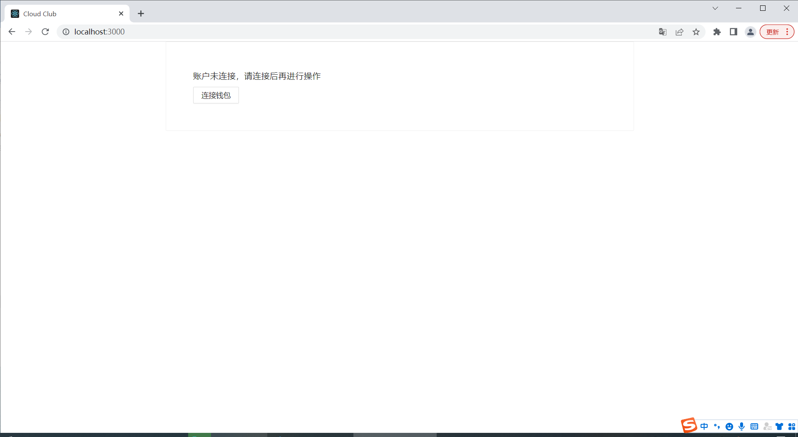


- 点击连接钱包功能后

  - 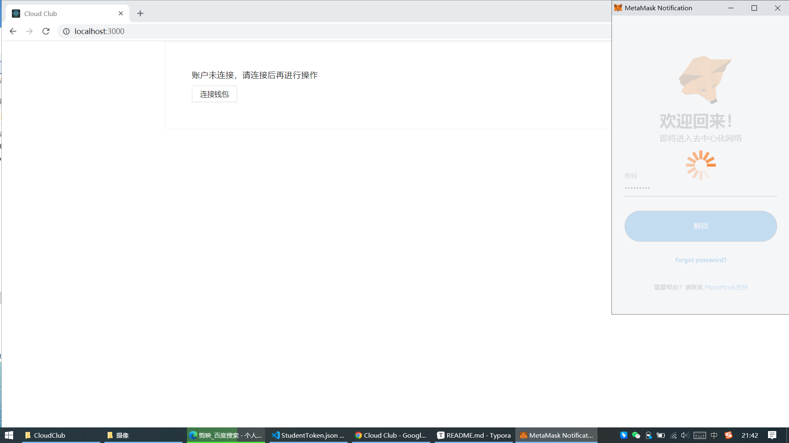


- 小狐狸连接成功后进入功能界面，如果登录成功则会有登录成功的提示符并展示如下的界面

  - 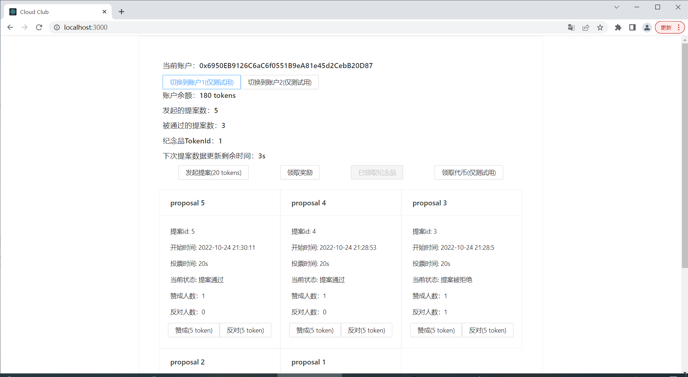


- 点击发起提案功能，调起信息输入框，填好信息后确认

  - 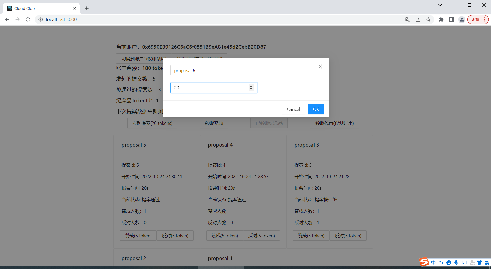


- 确认后可以看见界面中最新提案展示处出现了proposal 6这个提案

  - 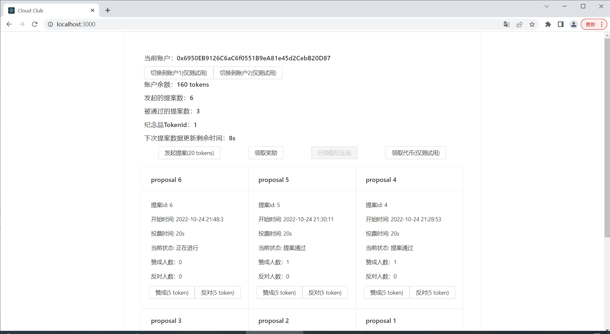


- 使用发起者账户点击赞成或反对按钮时都无法成功

  > - 由于提案6因为投票时间过去了被自动拒绝了因此我重新创建了一个提案7

  - 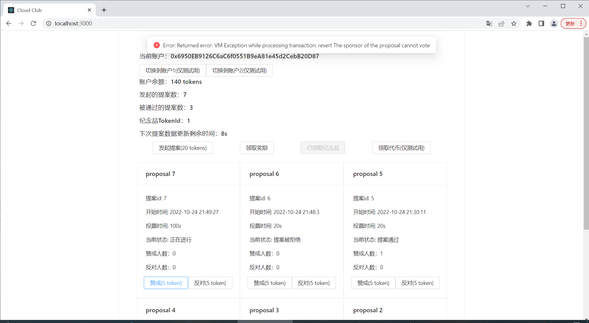


- 切换到账户2点击赞成出现投票成功，同时过一段时间后赞成人数+1

  - 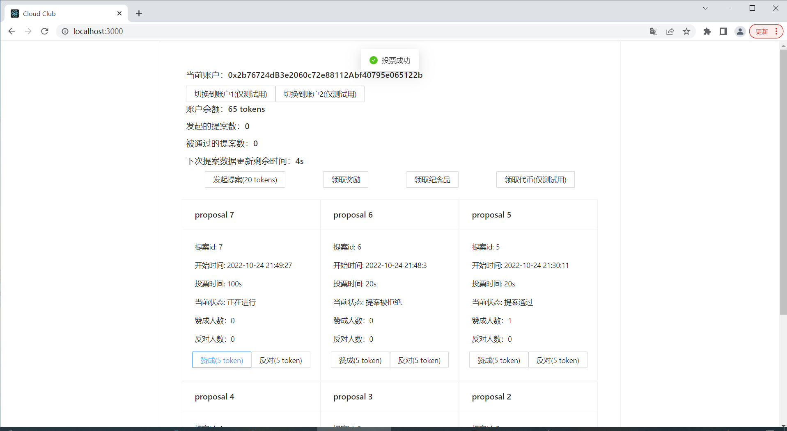


  - 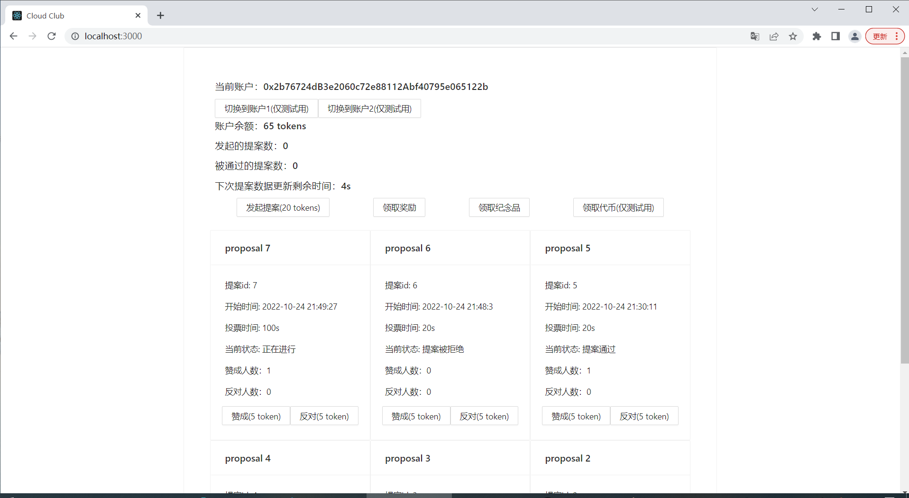


- 提案7的100s投票时间过去后提案被自动判决，可以看见由于提案赞成人数大于反对人数，提案被通过了

  - 


- 之后回到账户1中，想要重新发起提案发现出现错误信息

  - 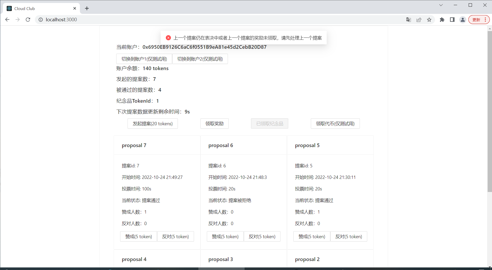


- 该错误信息是因为我们没有领取上一个提案的奖励或者上一个提案正在表决导致的，因此我们点击领取奖励领取上一个提案通过的奖励，该奖励的奖励token数量为20 + 投票人数 * 5

  > - 如果提案被拒绝则没有奖励，也不需要点击领取奖励就可以发起下一个提案

  - 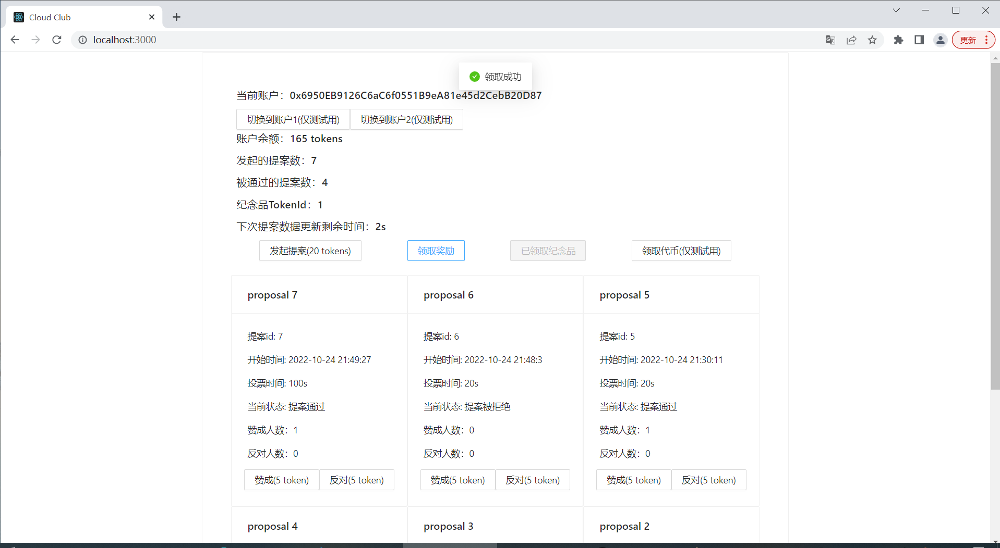


- 领取完奖励后我们用账户1发起提案8，可以看见提案被正常发布

  - 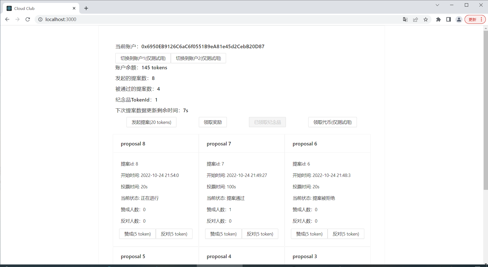


- 最后是领取纪念品功能，如果被通过的提案数不小于3则可以领取社团发布的纪念品，用户获得的是一个与自身账户地址绑定的tokenId

  > - 因为我之前已经领取过奖励，此时就无法再次领取了，领取了奖励的界面如上图，而账户2没有领取过奖励，没有领取过奖励的界面如下

  - 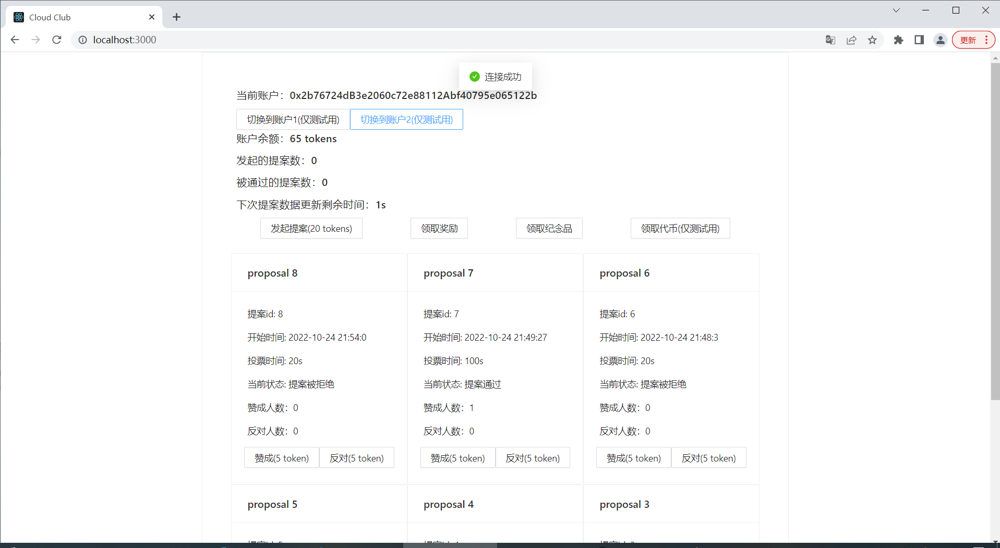


以上就是项目运行的全部内容，因为时间仓促，做出来的效果可能有点简陋，恳请批评指正！

## 参考内容

课程的参考Demo见：[DEMOs](https://github.com/LBruyne/blockchain-course-demos)

[web3.eth.Contract — web3.js 中文文档 — 登链社区 (learnblockchain.cn)](https://learnblockchain.cn/docs/web3.js/web3-eth-contract.html#events)

[node.js - web3.eth.subscribe未针对web3版本1.0.0-beta.27实现 - SO中文参考 - www.soinside.com](https://www.soinside.com/question/LR33hdhJQTh3WH7Z6JsUph)
